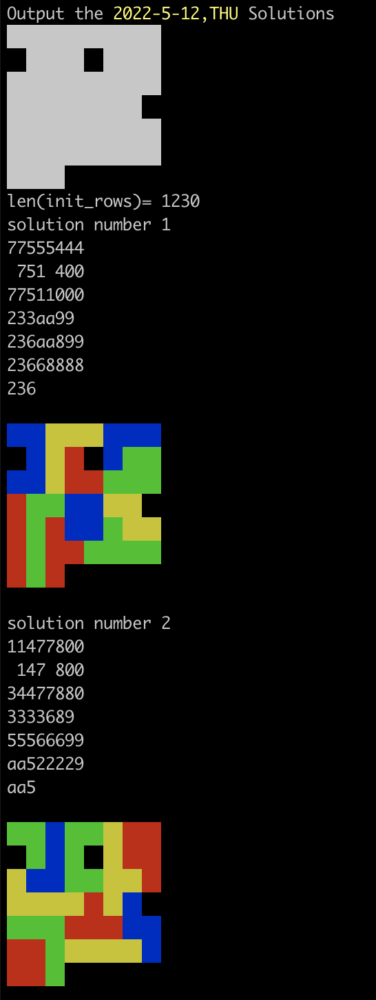

# Introduction

This tool is used to generate solutions for tiling puzzle "Make your Day", which is updated version of "A-Puzzle-A-Day".

## "A-Puzzle-A-Day"

### The board

```text
+-----+-----+-----+-----+-----+-----+
| JAN | FEB | MAR | APR | MAY | JUN |
+-----+-----+-----+-----+-----+-----+
| JUL | AUG | SEP | OCT | NOV | DEC |
+-----+-----+-----+-----+-----+-----+-----+
|  1  |  2  |  3  |  4  |  5  |  6  |  7  |
+-----+-----+-----+-----+-----+-----+-----+
|  8  |  9  |  10 |  11 |  12 |  13 |  14 |
+-----+-----+-----+-----+-----+-----+-----+
|  15 |  16 |  17 |  18 |  19 |  20 |  21 |
+-----+-----+-----+-----+-----+-----+-----+
|  22 |  23 |  24 |  25 |  26 |  27 |  28 |
+-----+-----+-----+-----+-----+-----+-----+
|  29 |  30 |  31 |                           
+-----+-----+-----+
```

### 8 flat shapes

```text
*** 
**

****
   *

***
  *
  * 

* *
***

  * 
****

** 
 *
 **

**
 ***

***
***
```


## "Make Your Day"

### The board

```text
+-----+-----+-----+-----+-----+-----+-----+-----+
| ^_^ | MON | TUE | WED | JAN | FEB | MAR | APR |
+-----+-----+-----+-----+-----+-----+-----+-----+
| THU | FRI | SAT | SUN | MAY | JUN | JUL | AUG |
+-----+-----+-----+-----+-----+-----+-----+-----+
|  1  |  2  |  3  |  4  | SEP | OCT | NOV | DEC |
+-----+-----+-----+-----+-----+-----+-----+-----+
|  5  |  6  |  7  |  8  |  9  |  10 |  11 |  12 |
+-----+-----+-----+-----+-----+-----+-----+-----+
|  13 |  14 |  15 |  16 |  17 |  18 |  19 |  20 |
+-----+-----+-----+-----+-----+-----+-----+-----+
|  21 |  22 |  23 |  24 |  25 |  26 |  27 |  28 |
+-----+-----+-----+-----+-----+-----+-----+-----+
|  29 |  30 |  31 |                           
+-----+-----+-----+
```

### 11 flat shapes

```text
***
**

**
*

****

****
   *

***
  *

***
  *
  *

***
 * 

* *
***

  * 
****

** 
 **

**
**
```

The source code is modified form "SAT/SMT by Example", thanks [Dennis Yurichev](https://yurichev.com/).

# Install

This program requires Z3 Theorem Prover installed.

```shell
pip3 install z3-solver
```

# Usage

```shell
$python3 makeyourday.py #year #month #day
```

For example:

```shell
$python3 makeyourday.py 2022 5 12
```

Example output:



The output may include all the possible solutions, and very long.

# Statement

This is my personal hobby program used to learn SAT/SMT, and has nothing to do with the authors of the puzzles. 

If you use this program, you may lose the joy of solving puzzles on your own.

Your are highly recommend to buy and enjoy the puzzles.